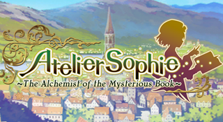
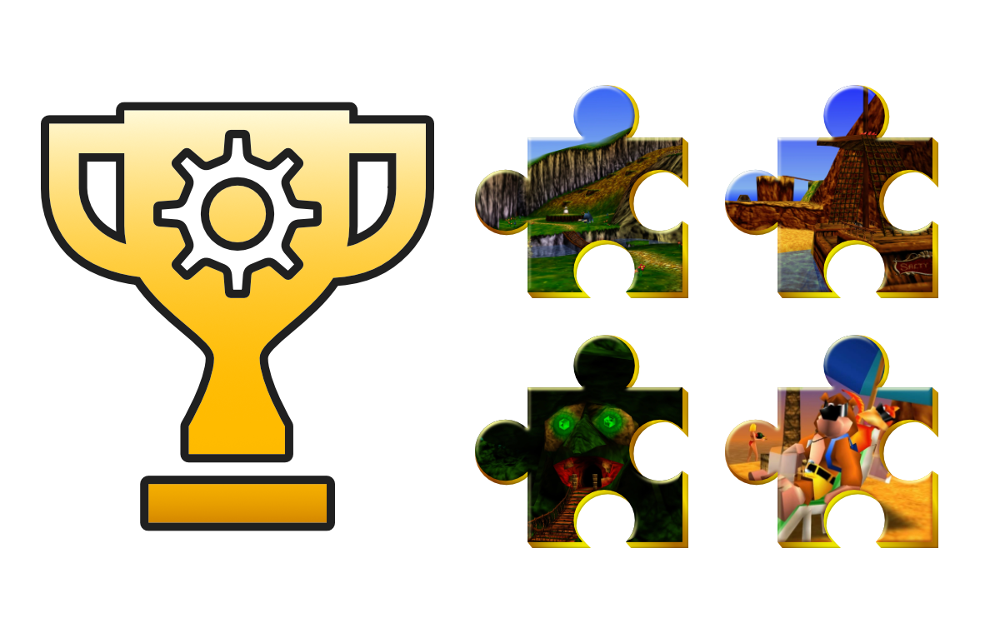
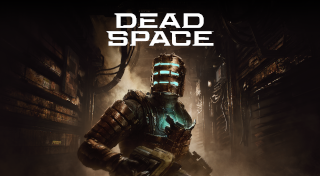
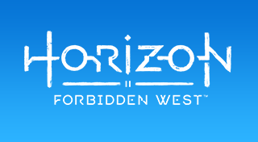
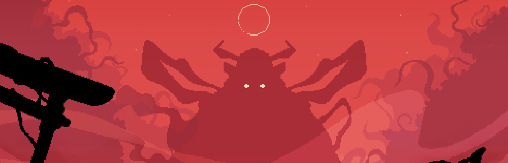

<!-- Generated by tools/Validator build-index; edits are overwritten. -->
# Per-game custom data

Per-game customizations: icon sets, categories, capstones, custom achievements, notes and ordering, one folder per game. Install from the Workshop in Playnite (which matches the game in your library), or download the `.pa` and import it from the game's Manage Achievements window.

6 game(s), 6 item(s).

| | Game | Platform | Items | Downloads |
|---|---|---|---:|---:|
|  | [Atelier Sophie: The Alchemist of the Mysterious Book](steam-527270/) | PC (Windows) | 1 | 5 |
|  | [Banjo-Kazooie](name-banjo-kazooie/) | Computer | 1 | 2 |
|  | [Dead Space](steam-1693980/) | PC (Windows) | 1 | 9 |
|  | [Horizon Forbidden West](steam-2420110/) | PC (Windows) | 1 | 4 |
|  | [Shogun Showdown](manual-2084000/) | PC (Windows) | 1 | 0 |
|  | [Sonic the Hedgehog 3](name-sonic-the-hedgehog-3/) | Computer | 1 | 1 |
